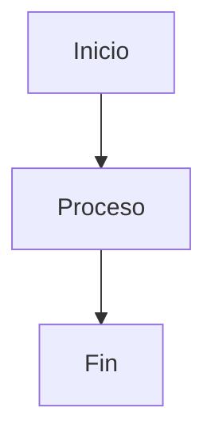

# Diagrama


```mermaid
flowchart TD
    A[Inicio] --> B[Proceso]
    B --> C[Fin]
```

# Código

```java
public class Main {
    public static void main(String[] args) {
        System.out.println("Hola, mundo");
    }
}
```

<p align="center">
    tarea
    
</p>
